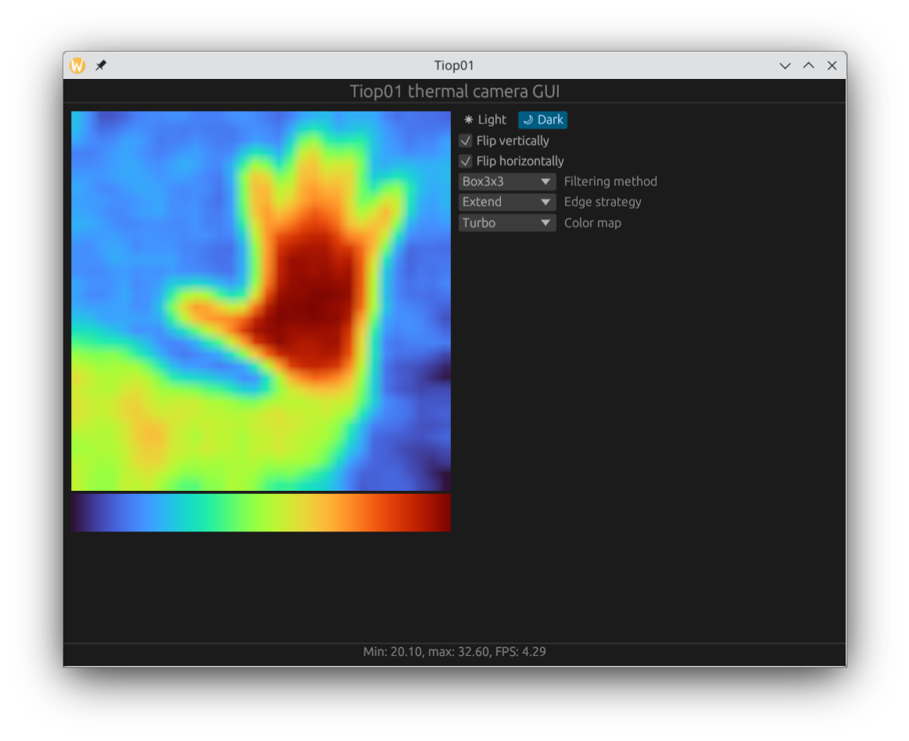

# tiop01-gui

## About
This is a POC application for TIOP01 thermal cameras. Those cheap cameras are available on AliExpress. They communicate via CDC (ACM) USB protocol and provide 32x32 images two bytes per pixel. 

## Compiling
### Linux
```
cargo build --features=desktop
```
### Android
Setup the environment:
```
export ANDROID_NDK_HOME="path/to/ndk"
export ANDROID_HOME="path/to/sdk"

rustup target add aarch64-linux-android
cargo install cargo-ndk
```
And build:
```
cargo ndk -t arm64-v8a build
```

## Screenshot


## Warning
This has been tested only on Arch Linux running Wayland and on a smartphone with Android 12.
